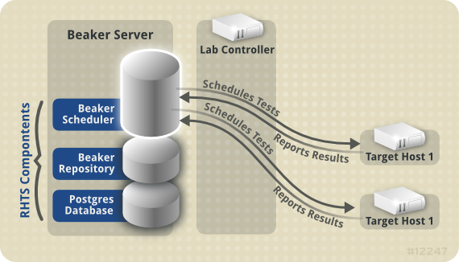

Beaker architecture
===================

Beaker is an automated software testing application that allows users to
store, manage, run and review the results of customized tasks. A task is
a script that performs a specific task (or multiple tasks) and presents
these task results to the user. These tasks consist of code, data, meta
data, shell scripts, hooks to other code, and additional packages (or
dependencies). Beaker provides an interactive web application and shell
based client to do this.

Although tasks can be written in any language that is supported by the
target host, environments such as ``rhts-devel`` and ``beakerlib`` are
often used. Tasks are written and (ideally) tested before being packaged
and uploaded to the server. Once they are uploaded to the server, they
are then available to deploy to a target host. The ``stdout`` of a task
executing on a target host is captured and made available via the beaker
web application.

Scheduler
---------

The Beaker scheduler co-ordinates the target host systems that will
ultimately run the tasks. It manages system selection and the
co-ordination of multiple hosts if the job specifications require them.
It also manages the schedule of when recipes are run. Currently it
operates on a simple FIFO queue. The scheduler does allow some recipes
to be prioritized over one another in a non FIFO fashion. This can
happen if the recipe matches only one system (priority is bumped by one
level), or if the priority is manually set (in which case it can also be
set lower).

Server and target host relationship
-----------------------------------

The server hosts the scheduler, the task repository and the web
application. Optionally, the lab controllers and database can also live
on the server. The target host makes requests to the server for packages
that it needs to create and setup the local test environment, then runs
the tasks specified in its recipe. These are run locally on the
target host.

   Server and target host relationship

The target host runs only one recipe at a time, and before each recipe
is run it is re-provisioned with a fresh distro install. As such, the
target host reports the results back to the server; It does not store
them locally.

Database
--------

The Beaker database is responsible for storing inventory, users and
groups, jobs, historical activity, task results and more. It is
configured in ``/etc/beaker/server.cfg`` (or an alternative
configuration file if one has been specified) with the
``sqlalchemy.dburi`` key. Any database type that is supported by
sqlalchemy can be used, however the test suite is only run performed
against MySQL.
