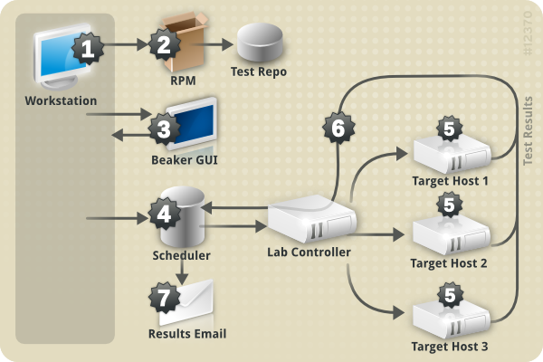

.. _chronological-overview:

Chronological overview
======================

This section describes how a user creates a script and integrates it
into the Beaker environment:

-  On a workstation, a user writes a script and then tests the code.

-  The user builds an RPM and submits it to the repository (If they are
   using one).

-  They add their task to Beaker's task library.

-  They create a job that uses the task.

-  The scheduler will then provision a system for the tasks to run on.

-  

   -  The task results are sent back to the scheduler for reporting.

-  The scheduler uses email to notify the users' of their task results.

   Chronological Overview

