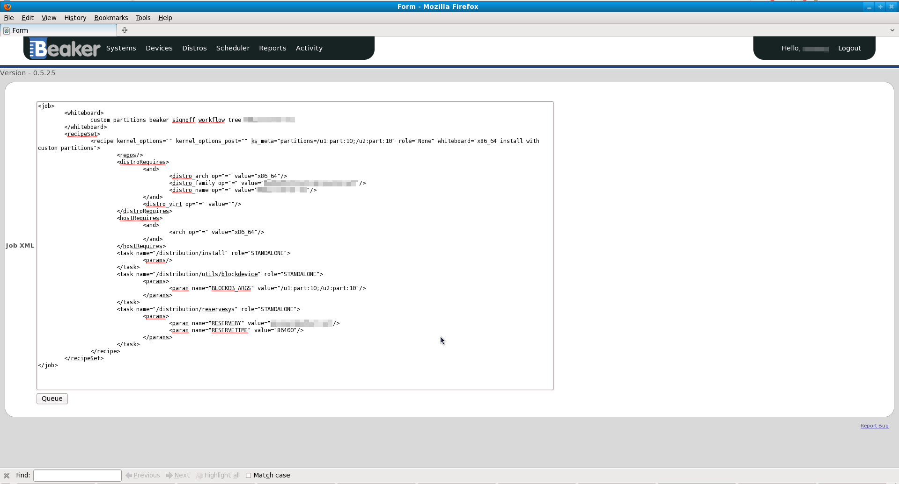

.. _jobs:

Jobs
~~~~

The purpose of a Job is to provide an encapsulation for tasks. It is to
provide a single point of submission for one or more of these tasks
and also reviewing the output and results of running them. The tasks
within a Job may or may not be related to each other; although it would make
sense to define Jobs based on the relationship of the tasks within it.
Once a Job has been submitted you cannot alter its contents, or pause
it. You can however cancel it (see :ref:`job-results`), and
alter a recipe set's priorities (you can only lower the priority level
if you are not in the admin group). Adjusting this priority upwards will
change which recipe set is run sooner, and vice a versa (See: :ref:`recipes`).

.. admonition:: Valid Job Specs

   If this is the first time running this Job make sure that at least one 
   system with the specified architecture has access to the specified distro 
   and all the relevant tasks are available to Beaker. To do this, See 
   :ref:`system-searching`, :ref:`distro-searching` and :ref:`task-searching` 
   respectively.

Creating your job XML
^^^^^^^^^^^^^^^^^^^^^

Beaker jobs are defined using an XML format. For details, see :doc:`job-xml`.

You can use the :ref:`bkr workflow-simple <bkr-workflow-simple>` client command 
to generate simple jobs. For more complicated logic, you can write a custom 
workflow command in Python.

.. _job-submission:

Job submission
^^^^^^^^^^^^^^

There are two ways of submitting a Job through the web UI. They are
outlined below.

.. _submitting-a-new-job:

Submitting a new job
''''''''''''''''''''
Once you have created an XML Job workflow, you are able to submit it as
a new "Job". To do this, go to the "Scheduler > New Job". Click "Browse"
to select your XML file, and then hit the "Submit Data" button. The next
page shown gives you an opportunity to check/edit your XML before
queuing it as a Job by pressing the "Queue" button. See
:ref:`job-workflow-details` for helpful information on writing your Job XML from
scratch. 

.. _cloning:

Cloning an existing job
'''''''''''''''''''''''

Cloning a Job means to take a Job that has already been run on the System, and 
re-submit it. To do this you first need to be on the :ref:`Job search 
<job-searching>` page.

   Cloning a Job

Clicking on "Clone" under the Action column will take you to a page that
shows the structure of the Job in the XML.

.. admonition:: Submitting a slightly different job

   If you want to submit a Job that's very similar to a Job already in
   Beaker,you can use the Clone button to change details of a previous Job
   and resubmit it!

.. _job-searching:

Searching for jobs
^^^^^^^^^^^^^^^^^^

You can search all Beaker jobs from the jobs page. Select 
:menuselection:`Scheduler --> Jobs` from the menu. Jobs are listed with the 
most recent at the top. You can click the :guilabel:`Running`, 
:guilabel:`Queued`, or :guilabel:`Completed` buttons to filter the list to 
running, queued, or completed jobs respectively. If you want to look up 
a specific job, enter its ID in the search box and click :guilabel:`Lookup ID`. 
Otherwise, you can click :guilabel:`Show Search Options` to search the jobs.

The "My Jobs" page behaves the same as the jobs page, except it is limited to 
jobs where you are the owner. Select :menuselection:`Hello --> My Jobs` from 
the menu.

Similarly, the "My Group Jobs" page is limited to jobs submitted for any group 
of which you are a member. Select :menuselection:`Hello --> My Group Jobs` from 
the menu.

.. _job-results:

Job results
^^^^^^^^^^^

The whole purpose of Jobs is to view the output of the Job, and more to
the point, tasks that ran within the Job. To do this, you must first go
to the :ref:`Job search <job-searching>` screen. After finding the Job you
want to see the results of, click on the link in the "ID" column.You
don't have to wait until the Job has completed to view the results. Of
course only the results of those Tasks that have already finished
running will be available.

The Job results page is divided by recipe sets. To show the results of
each Recipe within these recipe sets, click the "Show All Results"
button. You can just show the tasks that have a status of "Fail" by
clicking "Show Failed Results."

While your Job is still queued it's possible to change the priority. You
can change the priority of individual recipe sets by changing the value
of "Priority", or you can change all the Job's RecipeSets at once by
clicking an option beside the text "Set all RecipeSet priorities", which
is at the top right of the page. If successful, a green success message
will briefly display, otherwise a red error message will be shown.

.. admonition:: Priority permissions

   If you are not an Admin you will only be able to lower the priority.
   Admins can lower and raise the priority

.. figure:: job_priority_change.png
   :width: 100%
   :alt: [screenshot of changing priority]

   Changing the priority of a Job's RecipeSet

Result Details

-  *Run*

   -  This is the "ID" of the instance of the particular Task.

-  *Task*

   -  A Task which is part of our current Job.

-  *Start*

   -  The time at which the Task commenced.

-  *Finish*

   -  The time at which the Task completed.

-  *Duration*

   -  Time the Task took to run.

-  *Logs*

   -  This is a listing of all the output logs generated during the
      running of this Task.

-  *Status*

   -  This is the current Status of the Task. "Aborted","Cancelled" and
      "Completed" mean that the Task has finished running.

-  *Action*

   -  The two options here are Cancel and Clone. See :ref:`cloning` 
      to learn about cloning.

.. admonition:: Viewing Job results at a glance

   If you would to be able to look at the Result of all Tasks within 
   a particular Job, try the :ref:`Matrix Report <matrix-report>`.
