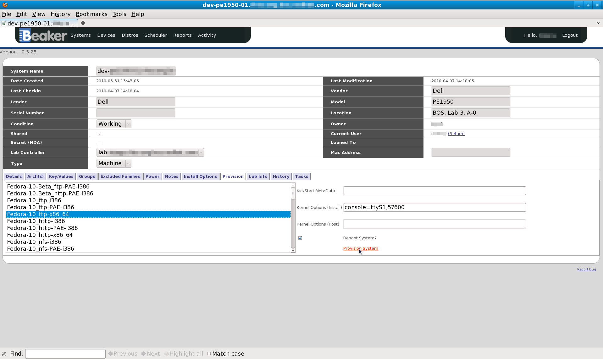

.. _provisioning-a-system:

Provisioning a system
---------------------

If you would like to use one of these System you will need to provision
it. Provisioning a System means to have the system loaded with an
Operating System and reserved for the user. There are a couple of ways
of doing this, which are outlined below.

Provision by System
~~~~~~~~~~~~~~~~~~~

Go to the System details page (see Section 5.1.3, “System Details Tabs”)
of a System that is free (see Section 5.1.1, “System Searching”) and
click on Take in the Current User field. After successfully taking the
System, click the Provision tab of the System details page to provision
the System.

.. admonition:: Returning a System

   After provisioning a system, you can manually return it by going to the 
   above mentioned system details page, clicking on the "Return" link in the 
   "Current User" field. However this is only allowed if the system was 
   provisioned manually (i.e not via a recipe)

   Provision by System

.. _provision-by-distro:

Provision by Distro
~~~~~~~~~~~~~~~~~~~

Go to the :ref:`distro search page <distro-searching>` and search for a
Distro you would like to provision onto a System. Once you have found
the Distro you require, click Provision System, which is located in the
far right column of your search results. If the "Provision System" link
is not there, it's because there is no suitable System available to use
with that Distro.

The resulting page lists the Systems you can use. Systems with "Reserve
Now" in the far right column mean that no on else is using them and you
can reserve them immediately, otherwise you will see "Queue
Reservation"; which means that someone is currently using the System but
you can be appended to the queue of people wanting to use this System.

After choosing your System and clicking on the the aforementioned links,
you will be presented with a form with the following fields:

-  *System To Provision* This is our System we will provision.

-  *Distro To Provision* The Distro we will be installing on the System.

-  *Job Whiteboard* This is a reference that will be displayed in Jobs
   list. You can enter anything in here.

-  *KickStartMetaData* Arguments passed to the KickStart script.

-  *Kernel Options* (Install)

-  *Kernel Options* (Post)

Pressing the "Queue Job" button will submit this provisioning as a Job
and redirect us to the details of the newly created Job.

Reserve Workflow
~~~~~~~~~~~~~~~~

The Reserve Workflow page is accessed from the top menu by going to
"Scheduler > Reserve". The Reserve Workflow process allows the ability
to select which System and Distro is to be provisioned based on the
following:

-  *Arch* Architecture of the System we want to provision.

-  *Distro Family* The family of Distro we want installed.

-  *Method* How we want the distro to be installed.

-  *Tag* The Distro's tag.

-  *Distro* Based on the above refinements we will be presented with a
   list of Distro's available to be installed.

Selecting values for the above items should be done in a top to bottom
fashion, staring at "Arch" and ending with "Distro".

Once the Distro to be installed is selected you have the option of
showing a list of System's that you are able to provision ("Show
Systems" button), or you can have Beaker automatically pick a system for
you ("Auto pick System"). If you choose "Show Systems" you will be
presented with a list of Systems you are able to provision. Ones that
are available now show the link "Reserve now" beside them. This
indicates the System is available to be provisioned immediately. If the
System is currently in use it will have the link "Queue Reservation"
instead. This indicates that the System is currently in use, but can be
provisioned for a later time.

Whether you choose to automatically pick a system or to pick one
yourself, you will be presented with a page that asks you for the
following options:

-  Job Whiteboard

-  KickStart MetaData

-  Kernel Options (Install)

-  Kernel Options (Post)

See :ref:`provision-by-distro` where the above are explained. Once you are 
ready you can provision your System with your selected Distro by pressing 
"Queue Job".
