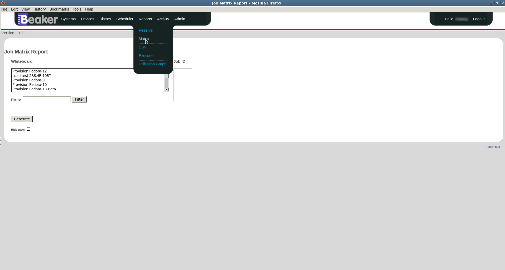

Reports
-------

Beaker offers a few different reports. They can be accessed from the
Reports menu at the top of the page.

External reports
~~~~~~~~~~~~~~~~

In some instances it may be preferential to provide Beaker related
reports external to the Beaker server itself. If your administrator has
configured any links to such reports, they will be displayed here.

.. _matrix-report:

Matrix report
~~~~~~~~~~~~~

The "Matrix" report gives a user an overall picture of results for any
given Job, or number of Jobs combined. It shows a matrix of Tasks run
and the Arch that they were run on. The "Reports->Matrix" is accessible
from the top menu.

   Generating a Matrix report from the Job's Whiteboard

There are two ways of defining what Job results to display. You can
select the Job by its "Whiteboard", or by its "Job ID". To show a Job's
Matrix report from its Whiteboard, click on the Whiteboard text in the
Whiteboard select box (or select multiple whiteboards with the *Ctrl*
key). If you wish to select the Job by its ID, enter the Job ID into the
"Job ID" text area. The Job Whiteboard and the Job ID are mutually
exclusive when generating the Matrix report. To change between the two,
click on their respective input areas. Click the "Generate" button to
create the report.

.. admonition:: Filtering Whiteboards

   You can filter what is displayed in the "Whiteboard" select box by typing 
   text into the "Filter by" field, and then clicking the *Filter* button

.. admonition:: Displaying reports of any combination of jobs

   Displaying the Matrix reports of any Jobs together, is possible when 
   selecting by "Job ID". Enter in all the relevant "Job ID"s separate by 
   whitespace or a newline.

.. figure:: report_matrix_generate.png
   :width: 100%
   :alt: [screenshot of matrix report]

   Generating a Matrix report from the Job ID

The generated Matrix report shows the result of each Task with its
corresponding Arch and Recipe Whiteboard. The points in the matrix
describe the result of the Task, and how many occurrences of that result
there are. Clicking on these results will take you to the "Executed
Tasks" page. See :ref:`task-searching` for further
details.

.. figure:: report_matrix_results.png
   :width: 100%
   :alt: [screenshot of matrix report]

   Viewing the result of one or more Jobs via the Matrix report
