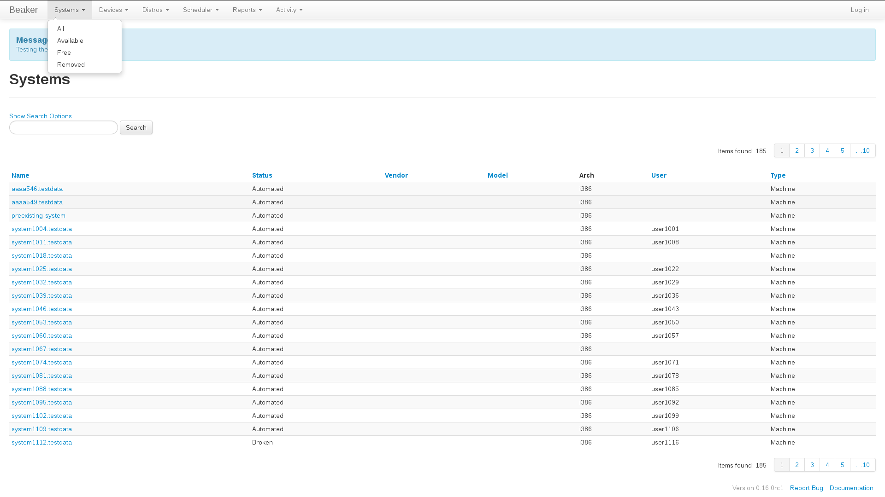
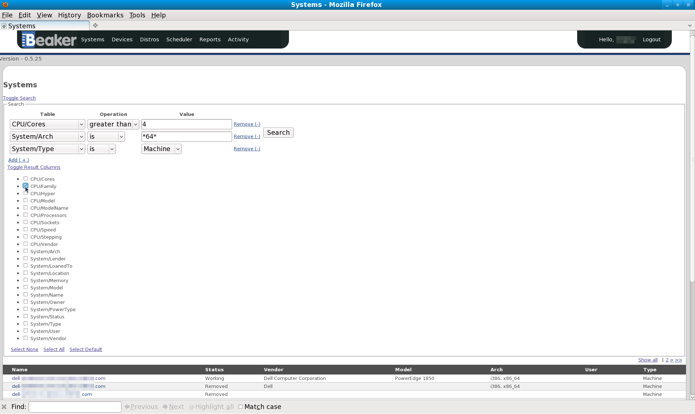
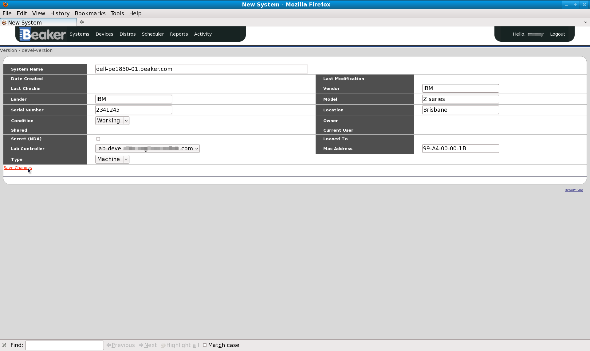
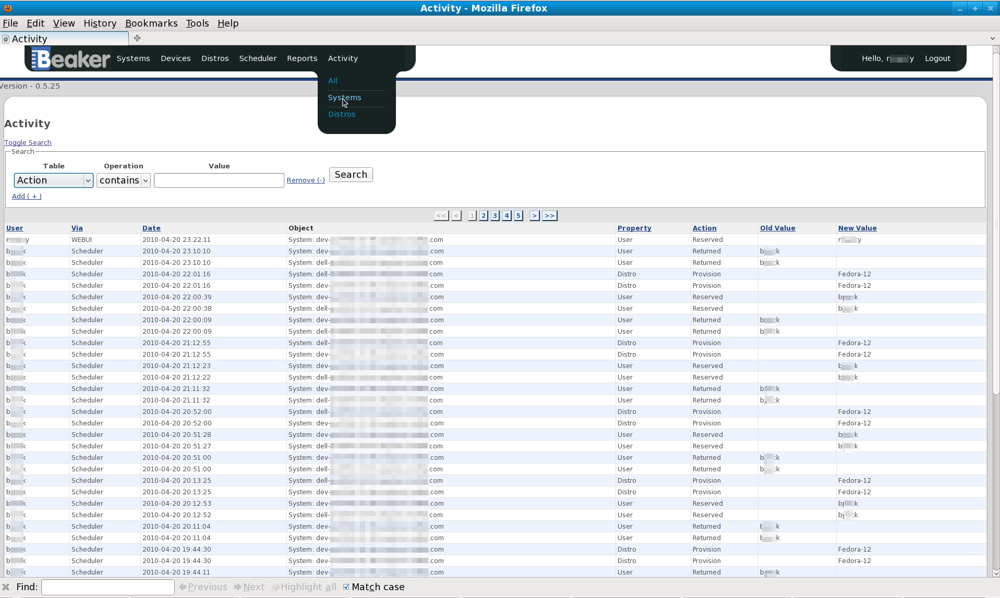

Systems
-------

Beaker provides an inventory of Systems(These could be a physical
machine,laptop,virtual guest, or resource) attached to lab controllers.
Systems can be added, removed, have details changed, and be provisioned
among other things.

.. _system-searching:

System searching
~~~~~~~~~~~~~~~~

System searches are conducted by clicking on one of the items of the
"System" menu at the top of the page.

-  System Searches

   -  *All*

      -  Will search through all Systems listed in Beaker.

   -  *Available*

      -  Will search through only Systems that the currently logged in
         user has permission to reserve.

   -  *Free*

      -  Will search through only Systems that the currently logged in
         user has permission to reserve and are currently free.

   System Menu

The search panel has two modes; simple and advanced. The simple search
is the default, and the default search is of the System name, using the
"contains" operator. To toggle between the two search modes, press the
"Toggle Search" link.

The first column ("Table") is the attribute on which the search is being
performed; The second ("Operation") is the type of search, and the third
("Value") is the actual value to search on. To add another search
criteria (row), click the "Add(+)" link just below the "Table" column.
When using more than just one search criteria, the default operation
between the criteria is an SQL AND operation. The operators change
depending on what type of attribute is being searched.

.. admonition:: Wildcards

   No operator provides explicit wildcards other than the is operation, which 
   allows the \* wildcard when searching an attribute which is a string.

The kind of data returned in the System search can be changed by
adding/removing the result columns. To do this the "Toggle Result
Columns" link is pressed and the columns checked/unchecked.

   Searching for a System

.. admonition:: Shortcut for finding systems you are using

   The top right hand corner has a menu which starts with Hello, followed by 
   the name of the user currently logged in. Click on this, then down to "My 
   Systems"

.. _adding-systems:

Adding a system
~~~~~~~~~~~~~~~

To add a System, go to any System search page, and click on the "Add(+)"
link on the bottom left. You must be logged in to do this. After filling
in the details, press the "Save Changes" button on the bottom left hand
corner.

   Adding a System

You will then need to update the Power details. To test they work, try hitting 
the power action buttons to ensure the system is responding correctly. The Arch 
details should then be updated, and then update the Install options with 
``console=ttyS1,115200n8 ksdevice=link`` for each arch. See 
:ref:`system-details-tabs`. You'll need to ensure that your System is hooked up 
to the conserver. Try provisioning a system (see :ref:`provisioning-a-system`). 
You can watch the provisioning process through the console. Please, be patient. 
The provisioning may take some time.

Once the System has been added, you should :ref:`create a job
<submitting-a-new-job>` to run the Beaker-provided :ref:`inventory-task` task
on the machine.  The easiest way to do this is to use the ``machine-test``
workflow to generate and submit an appropriate job definition::

    bkr machine-test --inventory --family=RedHatEnterpriseLinux6 \
         --arch=x86_64 --machine=<FQDN>

Refer to :ref:`bkr-machine-test` for more details.

.. _loaning-systems:

Loaning Systems
~~~~~~~~~~~~~~~
If you have admin permissions over a system, you will be able to loan the
system to other Beaker users. In the context of Beaker, loaning is the
assignment of a system to a user such that the system is exclusively available
to the loanee. The loanee also has the ability to manually reserve the system,
see :ref:`provisioning-a-system`.

To loan a system to another user, go to the :ref:`system-details` page
and next to the :guilabel:`Loaned to` field, click the link that says
:guilabel:`(Loan Settings)`. This will display a dialog where you can enter a user to
loan the system to. You can also enter a comment about the loan for future
reference. To return a loan, follow the steps above, but click
:guilabel:`Return Loan` instead.

.. admonition:: Comments

   Although a loan does not require a comment, the reverse is not true.
   Whenever a loan is returned, the comment is removed. Similarly,
   if the :guilabel:`Update Button` is clicked when the :guilabel:`Loan To`
   field is empty, then the loan is returned and any existing comment cleared.

Adding a driver disk
~~~~~~~~~~~~~~~~~~~~

Some systems may need a driver disk to be able to install certain
releases. In order to use a driver disk you need to host the driver disk
under the TFTP server so that it's available during netboot. You also
need to tell Beaker which families the driver disk is needed for.

-  First step is to install the driver disk on your lab controller(s).

   -  The following example assumes tftpboot is under /var/lib/tftpboot;
      this is true for RHEL6 and newer distros.

   -  Make a directory to host the driver disk.

      ::

          # mkdir -p /var/lib/tftpboot/dd/rhel6

   -  Copy the driver disk to this directory.

      ::

          # cp dd.img /var/lib/tftpboot/dd/rhel6

-  Second step is to set the family install options for the system that
   needs the driver disk.

   -  If you don't have any arch specific install options you need to
      create one first. Install options are inherited in the order of
      Arch, Family, and Update.

      .. figure:: initrd-driverdisk1.png
         :width: 100%
         :alt: [screenshot of Install Options tab]

         Adding a blank install option for arch.

   -  Once you have an arch specific entry you can create a family
      specific entry. The image below shows adding the driver disk we
      created for RHEL6. Notice that the path is from the chroot of the
      tftpserver, not /var/lib/tftpboot/.

      .. figure:: initrd-driverdisk2.png
         :width: 100%
         :alt: [screenshot of RHEL6 install options fields]

         Adding a driver disk entry for RHEL6.

.. _system-details:

System details
~~~~~~~~~~~~~~

After finding a System in the search page, clicking on the System name
will show the System details. To change these details, you must be
logged in as either the owner of the System, or an admin.

-  *System Name*: Unique hostname that identifies the machine, also
   referred to as FQDN (fully qualified domain name).

-  *Date Checkin*: When the machine was added to the inventory.

-  *Last Inventoried*: Last time this machine had its inventory updated

-  *Lender*: Name of the organization that has lent this system to
   beaker's inventory.

-  *Serial Number*: Serial Number of the machine.

-  *Condition*: This can be one of the following:

   -  *Automated*: In a working state, can have jobs run against it.

   -  *Manual*: In a working state, can not have jobs run against it
      (designed so people can test machine without having other
      people's jobs run on it).

   -  *Broken*: Not in a working state and not available to have
      jobs run on it.

   -  *Removed*: System no longer exists in the inventory.

-  *Shared*: Allows others to run jobs against this machine.

-  *Secret*: Stops other people from seeing this system in the
   inventory.

-  *Lab Controller*: The Lab controller to which it is connected.

-  *Type*: This can be one of the following:

   -  *Machine*: A physical machine that does not fit the other
      categories.

   -  *Laptop*: A laptop.

   -  *Virtual*: A virtual machine, this is just a placeholder that
      has a hostname and MAC address that corresponds to a DHCP
      record.

   -  *Resource*: Something which is not a computer. i.e a monitor.

   -  *Prototype*: New piece of hardware.

-  *Last Modification*: The last time the system details were
   changed.

-  *Vendor*: The brand.

-  *Model*: The model designation.

-  *Location*: The physical location.

-  *Owner*: The user who currently owns this machine (by default it
   is the user who added the entry to inventory, but owners can be
   reassigned)

-  *Loaned To*: The current Loanee. If this field is non empty, the
   system is only able to be used by the loanee.

-  *MAC Address*: The MAC address of the network device.

.. _system-details-tabs:

System details tabs
~~~~~~~~~~~~~~~~~~~

The system page also has a number of tabs with additional information:

Details
    Shows the details of the System's CPU, as well as Devices attached to the System. 
Arch(es)
    Shows the architectures supported by the system. 
Key/Values
    Shows further hardware details.
Groups
    Shows the groups of which this System is a member.
Excluded Families
    Are the list of Distros that this System does not support. 
Power
    Allows the powering off/on and rebooting of this System. These options are 
    only available if you are the current user of this System, in the admin 
    group or are part of a group that has been given admin rights over the 
    machine. Also the machine must be "taken".
Notes
    Any info about the system that you want others to see and doesn't fit in 
    anywhere else. If you have admin rights over the system you will be able to add 
    and delete notes, as well as show previously deleted notes.
Install Options
    These are default options which will be used when a system is provisioned. 
    You can create different options per Arch/Distro combination.
    See :ref:`install-options` for details about the meaning of these options.
Provision
    Allows the user of this System to install a Distro on it. 
Lab Info
    Will display practical details of the System like cost, power usage, weight 
    etc. 
History
    Shows the activity on this System for the duration of the systems life as 
    an inventory item in Beaker. These activities can also be searched. By 
    default, the simple search does a "contains" search on the Field attribute. 
    Please see :ref:`system-searching` for details on searching. 

System activity
~~~~~~~~~~~~~~~

To search through the historical activity of all Systems, navigate to
"Activity>Systems" at the top of the page.

   Searching through all Systems' activity

To search the history of a specific system, you can also use the "History" tab 
on the system page. See :ref:`system-details-tabs`.
